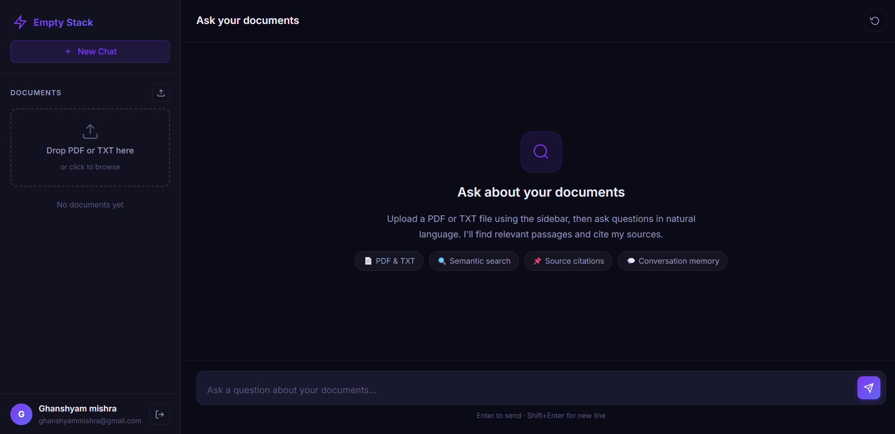

# Empty Stack — RAG Document Intelligence

A production-ready full-stack app that lets you upload documents and ask questions in plain English, with AI-powered answers and source citations.

Upload a PDF or TXT → ask questions → get answers with source citations.

---

## Screenshot



## Tech Stack

| Layer | Technology |
|---|---|
| Language | Java 17 |
| Framework | Spring Boot 3.3.5 |
| AI Framework | Spring AI 1.1.1 |
| Embedding Model | Gemini `gemini-embedding-001` (3072 dims) |
| LLM | Gemini 2.0 Flash |
| Vector Store | PostgreSQL + pgvector |
| PDF Parsing | Apache PDFBox 3.x |
| DB Migrations | Flyway |
| Auth | Spring Security + JWT |
| Frontend | Vanilla JS + CSS (served by Spring Boot) |
| Containerization | Docker + Docker Compose |

---

## How RAG Works

```
User uploads PDF
  → chunked into 500-token pieces
  → each chunk embedded into a vector

User asks a question
  → question embedded
  → cosine similarity search in pgvector
  → top 5 matching chunks injected into Gemini prompt
  → answer returned with source citations
```

---

## Project Structure

```
src/main/java/com/ghanshyam/empty_stack/
├── controller/
│   ├── DocumentController.java    # upload, list, delete endpoints
│   ├── ChatController.java        # ask, clear history endpoints
│   └── AuthController.java        # register, login endpoints
├── service/
│   ├── DocumentService.java       # orchestrates upload pipeline
│   ├── ChunkingService.java       # PDF parsing + text chunking
│   ├── EmbeddingService.java      # Gemini embedding via REST
│   └── ChatService.java           # RAG Q&A + conversational memory
├── model/
│   ├── Document.java
│   └── DocumentChunk.java
├── repository/
│   ├── DocumentRepository.java
│   └── DocumentChunkRepository.java
├── security/
│   ├── SecurityConfig.java
│   └── JwtUtil.java
└── dto/
    ├── ChatRequest.java
    ├── ChatResponse.java
    └── ChunkSearchResult.java

src/main/resources/
├── static/                        # Frontend (served by Spring Boot)
│   ├── index.html
│   ├── css/style.css
│   └── js/app.js
└── application.yml
```

---

## Running with Docker (Recommended)

The entire stack — app, PostgreSQL with pgvector — is wired up in `docker-compose.yml`. One command starts everything:

```bash
# 1. Add your Gemini API key to docker-compose.yml (GEMINI_API_KEY env var)
# 2. Start everything
docker compose up --build
```

The app will be available at `http://localhost:8080`.

No separate frontend server needed — the UI is served directly by Spring Boot from `src/main/resources/static/`.

---

## Running Locally (Without Docker)

### Prerequisites

- Java 17+
- Docker Desktop (for PostgreSQL only)
- Gemini API key (free at [aistudio.google.com](https://aistudio.google.com))

### 1. Clone the repo

```bash
git clone https://github.com/Ghanshyam32/rag-document-intelligence.git
cd rag-document-intelligence
```

### 2. Configure

```bash
copy src\main\resources\application.yml.example src\main\resources\application.yml
# Edit application.yml and add your Gemini API key
```

### 3. Start PostgreSQL

```bash
docker compose up -d db
```

### 4. Run the app

```bash
mvn spring-boot:run
```

Open `http://localhost:8080` — register an account and start uploading documents.

---

## API Endpoints

### Auth

| Method | Endpoint | Description |
|---|---|---|
| `POST` | `/api/auth/register` | Create a new account |
| `POST` | `/api/auth/login` | Login, returns JWT token |

### Document Management

| Method | Endpoint | Description |
|---|---|---|
| `POST` | `/api/documents/upload` | Upload and index a PDF or TXT file |
| `GET` | `/api/documents` | List all indexed documents |
| `GET` | `/api/documents/{id}` | Get document details |
| `DELETE` | `/api/documents/{id}` | Delete document and its embeddings |

### Chat / Q&A

| Method | Endpoint | Description |
|---|---|---|
| `POST` | `/api/chat/ask` | Ask a question, get answer + sources |
| `DELETE` | `/api/chat/history/{id}` | Clear conversation memory |

---

## Example Usage

**Register:**

```bash
curl -X POST http://localhost:8080/api/auth/register \
  -H "Content-Type: application/json" \
  -d '{"name": "Jane", "email": "jane@example.com", "password": "secret"}'
```

**Upload a document:**

```bash
curl -X POST http://localhost:8080/api/documents/upload \
  -H "Authorization: Bearer <token>" \
  -F "file=@handbook.pdf"
```

**Ask a question:**

```bash
curl -X POST http://localhost:8080/api/chat/ask \
  -H "Content-Type: application/json" \
  -H "Authorization: Bearer <token>" \
  -d '{"question": "What is the leave policy for new employees?"}'
```

**Response:**

```json
{
  "answer": "New employees are entitled to 12 days of casual leave per year (from handbook.pdf).",
  "conversationId": "uuid-here",
  "sources": [
    {
      "documentName": "handbook.pdf",
      "chunkIndex": 14,
      "excerpt": "New employees during their probation period..."
    }
  ]
}
```

---

## Chunking Strategy

- **Chunk size:** 500 tokens
- **Overlap:** 50 tokens — prevents context loss at chunk boundaries
- Split on whitespace; overlap ensures sentences aren't cut mid-thought
